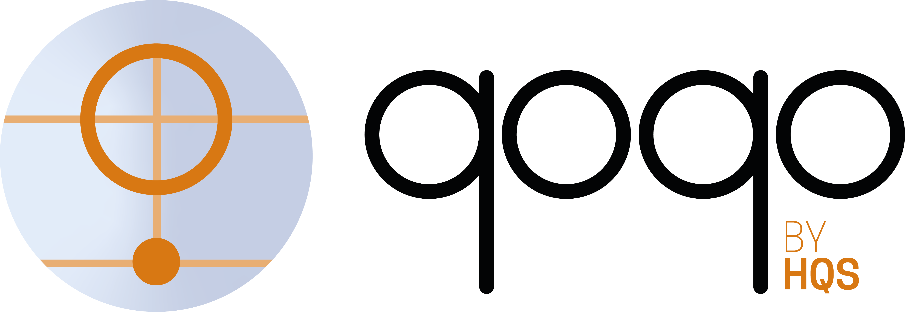

# qoqo

Quantum Operation Quantum Operation  
Yes we use [reduplication](https://en.wikipedia.org/wiki/Reduplication)

qoqo is a toolkit to represent quantum circuits by [HQS Quantum Simulations](https://quantumsimulations.de).

This repository contains two components:

* roqoqo: the core rust library
* qoqo: the python interface to roqoqo

What roqoqo/qoqo is:

* A toolkit to represent quantum operations and circuits
* A thin runtime to run quantum measurements
* A way to serialize quantum circuits and measurement information
* A set of optional interfaces to devices, simulators and toolkits (e.g. [qoqo_pyqest](https://github.com/HQSquantumsimulations/qoqo_pyquest), [qoqo_mock](https://github.com/HQSquantumsimulations/qoqo_mock), [qoqo_qasm](https://github.com/HQSquantumsimulations/qoqo_qasm))

What roqoqo/qoqo is **not**:

* A decomposer translating circuits to a specific set of gates
* A quantum circuit optimizer
* A collection of quantum algorithms

## roqoqo
[]
(crates.io link?)

roqoqo provides:

* A circuit struct to represent quantum programs
* Single-Qubit, Two-Qubit and Multi-Qubit Operations that can be executed (decomposed) on any universal quantum computer
* PRAGMA Operations that only apply to certain hardware, simulators or annotate circuits with additional information
* Classical Registers and Measurement operations to use with a quantum program
* Measurement structs for evaluating observable measurements based on projective measurements from quantum hardware or simulator readouts
* A Backend trait defining a standard for interfacing from qoqo to other toolkits, hardware and simulators that can return measured values
* Serialize and deserialize support for circuits and measurement information via the serde crate.

This software is still in the beta stage. Functions and documentation are not yet complete and breaking changes can occur.
## qoqo

qoqo provides a full python interface to the underlying roqoqo library, including:

* A circuit class to represent quantum programs
* Single-Qubit, Two-Qubit and Multi-Qubit Operations that can be executed (decomposed) on any universal quantum computer
* PRAGMA Operations that only apply to certain hardware, simulators or annotate circuits with additional information
* Classical Register and Measurement operations to use with a quantum program
* Measurement structs for evaluating observable measurements based on projective measurements from quantum hardware or simulator readouts
* A DoUnitary class combining circuits and measurement information in complete quantum programms with a simple interface
* Serialization to json and deserialization from json for circuits and measurement information. Serialization support can easily be expanded to other targets with the help of the serde crate.

### Examples

For an expanded collection of Examples see the jupyter notebooks in qoqo/examples. The examples require the qoqo_pyquest and qoqo_mock interfaces.

* [Intro example](https://nbviewer.jupyter.org/github/HQSquantumsimulations/qoqo/blob/main/qoqo/examples/Intro_to_qoqo.ipynb)

## Contributing

We welcome contributions to the project. If you want to contribute code, please have a look at CONTRIBUTE.md for our code contribution guidelines.
