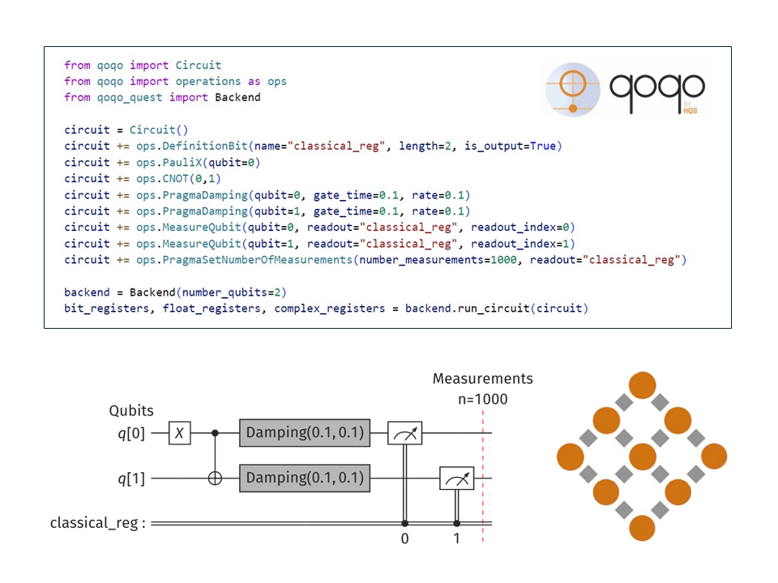

# Introduction

**Welcome to the user documentation for the qoqo/roqoqo quantum computing toolkit.**

This user documentation gives a general overview of the design principles and intended usage scenarios for qoqo and roqoqo. For a detailed description of all the types and functions, see the API-documentation of [roqoqo](https://docs.rs/roqoqo/) and [qoqo](https://hqsquantumsimulations.github.io/qoqo/).

## What are qoqo and roqoqo

The qoqo and roqoqo packages are a pair of quantum computing toolkits by [HQS Quantum Simulations](https://quantumsimulations.de).

Like many quantum toolkits, qoqo and roqoqo are circuit-based toolkits, at the core. A sequence of operations to be run on a quantum computer is grouped into a [quantum circuit](circuits/intro.md).

In the majority of quantum computing applications, the output of several quantum circuits needs to be collected and processed using additional classical measurement input, in order to construct a usable measurement result (e.g. when using a quantum computer to simulate physical quantum systems).

qoqo and roqoqo also provide tools to group quantum circuits and measurement input into a [QuantumProgram](high-level/intro.md). QuantumPrograms are designed as a high-level interface to quantum computations that can be used similar to standard function calls.
QuantumPrograms accept floating point inputs, can be serialized, and only need qoqo/roqoqo and a simulator or a hardware backend to be executed.

### What roqoqo/qoqo is

* A toolkit to represent quantum operations and circuits
* A tool to package quantum circuits and classical information into quantum programs
* A way to serialize quantum programs
* A set of optional interfaces to devices, simulators and toolkits (e.g. [qoqo_quest](https://github.com/HQSquantumsimulations/qoqo-quest), [qoqo_mock](https://github.com/HQSquantumsimulations/qoqo_mock), [qoqo_qasm](https://github.com/HQSquantumsimulations/qoqo_qasm))

### What roqoqo/qoqo is **not**

* A decomposer translating circuits to a specific set of gates
* A quantum circuit optimizer
* A collection of quantum algorithms

### qoqo vs roqoqo

roqoqo is the core implementation of the toolkit. It is written in Rust.
qoqo is the Python interface to roqoqo and provides operations, Circuit, measurements and QuantumProgram from roqoqo in the Python environment.

## Architecture

roqoqo has several components:

* Operations and Circuit (see [Quantum Circuits](circuits/intro.md))
* Measurements and QuantumProgram (see [High-Level Interface: Quantum Programs](high-level/intro.md))
* Backends (see [Backends](backends.md))
* Devices (see [Devices](devices.md))

Operations and Circuit can be used to represent single quantum circuits that run on quantum hardware.

Measurements and QuantumProgram combine several circuits with classical information, to provide a high-level interface for running quantum programs that yield an immediately usable result.

To execute quantum circuits or quantum programs, a backend connecting to quantum hardware or a simulator is required.
qoqo/roqoqo does not directly implement these backends. To minimize dependencies, backends are implemented in separate packages (e.g. `qoqo-quest`).
In the `backends` module roqoqo provides an interface description for backends with the `EvaluatingBackend` Rust trait.

When compiling quantum circuits, it is often necessary to know the topology of a target quantum device. Device properties can also be used by backends, for example to accurately simulate a given quantum device.
qoqo/roqoqo defines an interface for obtaining the device topology and the noise properties. The interface is defined by roqoqo's `Device` trait. Additionally qoqo/roqoqo provides some simple devices that can be used to quickly define simple device topologies.

The following schematic shows how the different components are related when running a quantum program:

The circuit compilation use cases can be visualized in a similar way:

### API Documentation

The API documentation can be found at the following link:

 - [Python API](https://hqsquantumsimulations.github.io/qoqo/python_api_docs/index.html)
